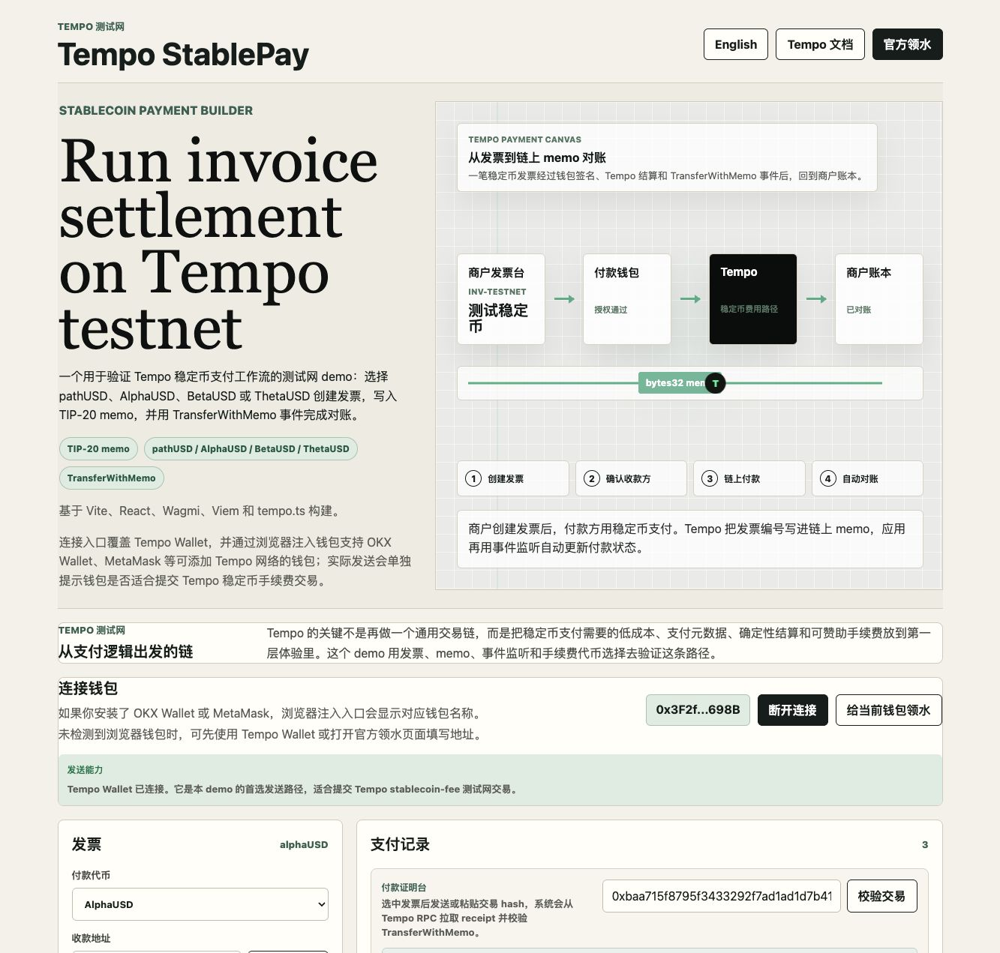
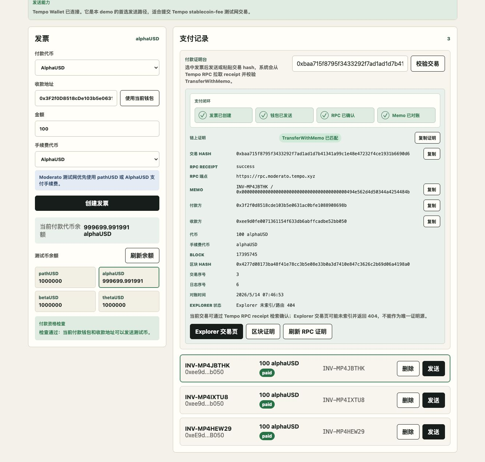

# Tempo StablePay

Tempo StablePay is a public testnet demo for invoice-style stablecoin payments on Tempo. It uses a TIP-20 memo transfer to connect a payment with a business invoice, then verifies the payment through the Tempo RPC receipt and `TransferWithMemo` event.

Live demo: https://stablecoin-payment-builder-plan.vercel.app/

Published write-up: https://x.com/LiuNengBoy/status/2054765398441197691



## What It Demonstrates

Most wallet transfers answer one question: did tokens move from one address to another?

StablePay tests a more payment-oriented loop:

```txt
invoice -> memo -> transferWithMemo -> RPC receipt -> TransferWithMemo match -> paid
```

The demo creates a local invoice, encodes the invoice reference as a `bytes32` memo, sends a selected Tempo test stablecoin, and reconciles the invoice from the matching `TransferWithMemo` event.

## Features

- Invoice creation with recipient, amount, payment token, fee token, and memo.
- Payment-token options: `pathUSD`, `AlphaUSD`, `BetaUSD`, `ThetaUSD`.
- Fee-token options: `pathUSD`, `AlphaUSD`.
- Tempo Wallet primary send path.
- Injected wallet connection path for wallets such as OKX Wallet and MetaMask where supported.
- RPC receipt verification.
- `TransferWithMemo` log matching.
- Copyable payment proof bundle.
- Bilingual interface in Chinese and English.

## Payment Proof

A successful Tempo Wallet transaction was verified through Tempo RPC:

```txt
tx hash: 0xbaa715f8795f3433292f7ad1ad1d7b41341a99c1e48e47232f4ce1931b6690d6
rpc: https://rpc.moderato.tempo.xyz
status: success
block: 17395745
token: AlphaUSD
fee token: AlphaUSD
memo: INV-MP4JBTHK
TransferWithMemo log index: 6
```

Tempo Explorer can currently return `404` for this transaction route even when the RPC receipt confirms success. For this demo, the RPC receipt plus decoded `TransferWithMemo` log is treated as the primary proof source.



## Tech Stack

- Vite
- React
- TypeScript
- Wagmi
- Viem
- `tempo.ts`
- Vercel

## Run Locally

```sh
npm install
npm --workspace apps/tempo-stablepay run dev
```

Build:

```sh
npm --workspace apps/tempo-stablepay run build
```

## Repository Structure

```txt
apps/tempo-stablepay/   React demo app
docs/                   Research notes, delivery package, article materials
docs/assets/            Screenshots used for the public write-up
vercel.json             Vercel build configuration
```

## Limitations

- Testnet only.
- Invoices are stored in browser local storage.
- No backend database, webhook, or merchant ledger service yet.
- Fee sponsorship is documented as a follow-up item until it is validated end to end.
- Injected wallets may connect to Tempo Testnet but can still fail during Tempo stablecoin-fee transaction submission.
- Explorer indexing should be treated as a secondary convenience surface until it consistently matches RPC receipts.

## Further Reading

- [Tempo delivery package](docs/tempo-delivery-package.md)
- [Tempo current state review](docs/tempo-current-state.md)
- [Build gate](docs/tempo-build-gate.md)
- [Vercel deployment notes](docs/vercel-deployment.md)
